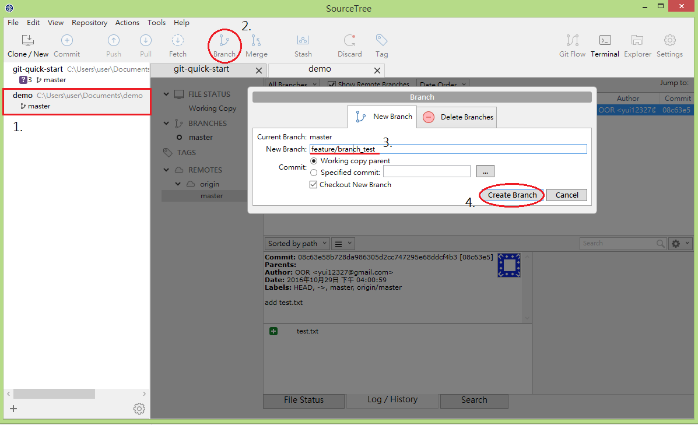
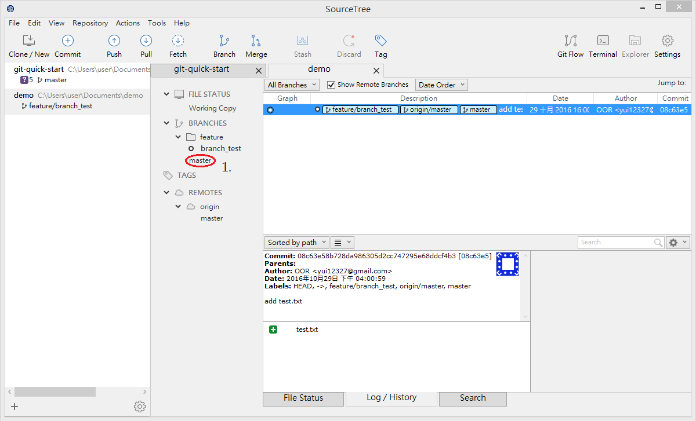
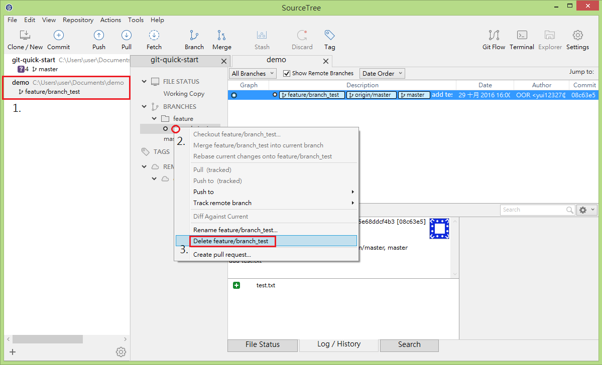
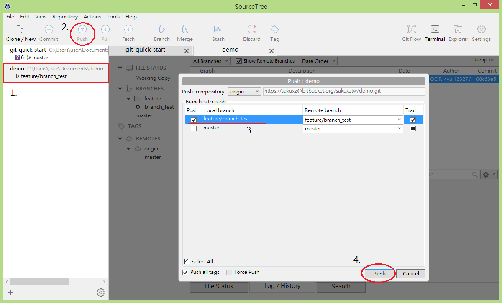

# branch

在開發軟體時，可能同時會有多人在開發同一功能或修復錯誤，也可能會有多個發佈版本的存在，並且需要針對每個版本進行維護。

為了能支援同時進行數個功能的增加或版本控制，Git具備了分支的功能。

分支是為了將修改記錄的整體流程分開儲存，讓分開的分支不受其他分支的影響，所以在同一個數據庫裡可以同時進行多個不同的修改。

## 建立 branch

1. 於 SourceTree 左側的專案列表上找到您欲新增 branch 的專案
2. 點擊 Branch 按鈕
3. 設定您欲新增 Branch 的名字
4. 點擊 Create Branch 按鈕，完成 branch 建立， SourceTree 會自動將您目前環境切到 branch 上

#### 此操作對應之 git 指令

`git branch feature_x`

## 切換 branch

1. 於 SourceTree 左側的專案列表上找到您欲切換 branch 的專案
2. 在愈切換之 branch 名字上快按兩下，即可切換到該 branch 環境

#### 此操作對應之 git 指令

`git checkout feature_x`

## 刪除 branch

1. 於 SourceTree 左側的專案列表上找到您欲刪除 branch 的專案
2. 在愈刪除之 branch 名字上按右鍵開啟選單
3. 點擊選單中 Delete XXX 按鈕，即可刪除 branch

#### 此操作對應之 git 指令

`git branch -d feature_x`

## 將 branch push 至遠端

1. 於 SourceTree 左側的專案列表上找到您欲 push 的專案
2. 點擊 Push 按鈕
3. 勾選欲 push 之 branch 名字
4. 點擊 Push 按鈕，即可將 branch push 至遠端

#### 此操作對應之 git 指令

`git push origin <branch>`

## 練習

### 創建 git 版本控制專案

1. 新增資料夾 git-tutorial
2. 進入 git-tutorial 資料夾
2. 新增檔案 README.md
3. 執行 `git init` 初始化專案
4. 執行 `git add .` 加入所有變更的檔案
5. 執行 git commit -m 'init'

### 建立分支

1. 執行 `git branch develop`
2. 切換到 develop 分支 `git checkout develop`
3. 修改 README.md 新增 `hello develop branch`
4. 執行 git commit -m 'add develop branch'
5. 執行 `git log --graph --oneline --decorate --all`
6. 確認已有新的分支產生
