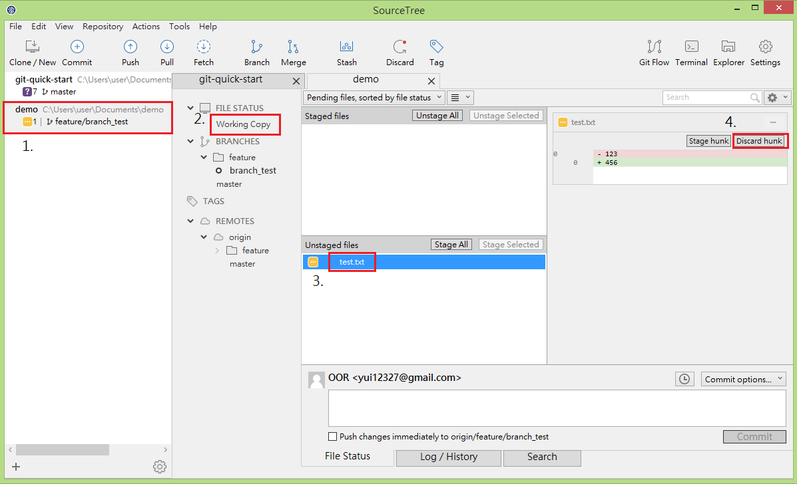

# checkout

checkout 可用於將特定版本檔案取出，無論是資料夾或檔案皆可

## 取出特定檔案

> 將 test.txt 內容做修改

1. 於 SourceTree 左側的專案列表上找到您欲取出檔案的專案
2. 點擊 Working Copy 查看你目前對專案的變更
3. 點擊 test.txt 便可以於右邊面板查看該檔案詳細變更
4. 點擊 Discard hunk 按鈕，便可以捨棄對 test.txt 的變更，此範例中 test.txt 內容會還原成 123

## 本章節操作對應之 git 指令

`git checkout <file path>`

## 練習

### 練習專案初始

1. 新增資料夾 git-tutorial
2. 進入 git-tutorial 資料夾
2. 新增檔案 README.md
3. 執行 `git init` 初始化專案
4. 執行 `git add .` 加入所有變更的檔案
5. 執行 git commit -m 'init'
6. 完成第一個版本控制

### 進行修改後透過 checkout 復原修改

1. 編輯 README.md 在第一行寫入 `hello world` 存檔離開
2. 透過 `git status` 確認目前修改狀態
3. 執行 `git checkout README.md` 將檔案復原
4. 執行 `git status` 確認目前已無最新的變動
