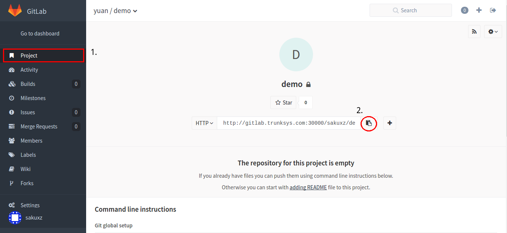
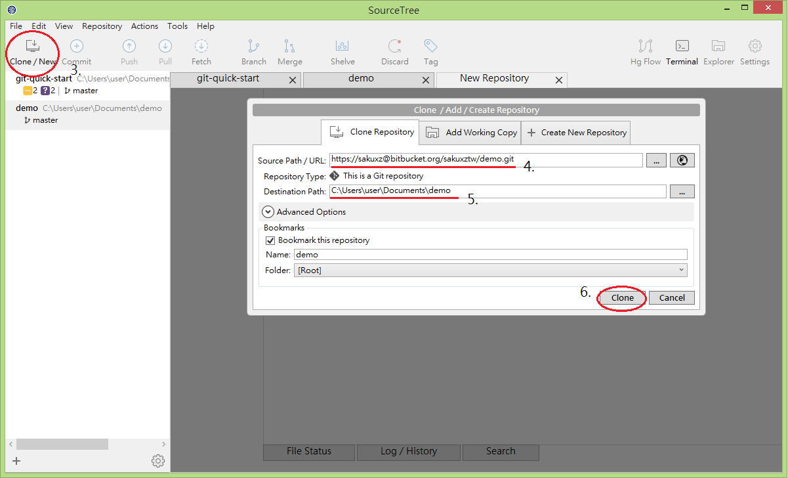

# clone

要下載遠端數據庫需要進行複製（Clone）的操作。

執行複製後，可以把遠端數據庫裡的內容全部下載下來，之後您可以在另一台機器的本地數據庫上進行操作。

## 取出遠端專案

> 以 GitLab 上代管的遠端數據庫為例

#### 取的遠端數據庫網址

1. 點擊 GitLab 側邊選單上的 Project，找到你需要的專案
2. 點擊按鈕複製 repository url（http://gitlab.trunksys.com:30000/ewill/machine-service.git）

#### 開啟 SourceTree 進行 Clone 操作

3. 點擊 SourceTree 工具攔上的 Clone/New
4. 貼上剛剛複製之 repository url
5. 設定本地數據庫放置資料夾（Optional）
6. 點擊 Clone 按鈕

## 本章節操作對應之 git 指令

`git clone /path/to/repository`

`git clone username@host:/path/to/repository`
