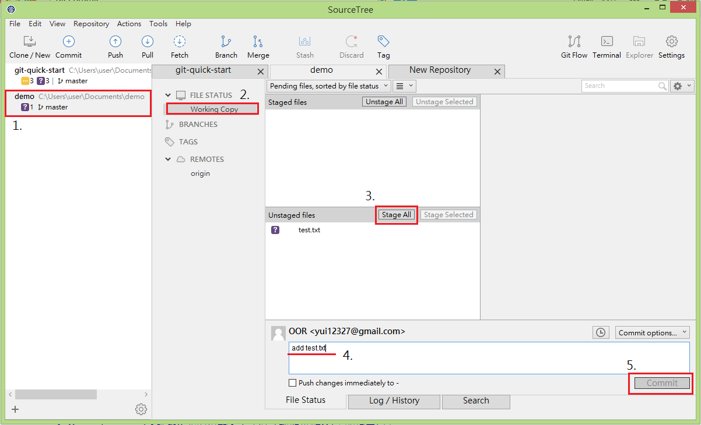

# Commit

當修改或是新增專案程式檔案時，可以透過 Commit 動作將其紀錄於本地版控數據庫，以便將來可以查詢/回復您對專案的變更，並可以搭配接下來章節所教的 Push 將本地版控數據庫的變更與遠端版控數據庫作同步。

## 新增您欲紀錄的變更與 Commit

> 於專案目錄中新增 test.txt 檔案

1. 於 SourceTree 左側的專案列表上找到您剛剛修改的專案
2. 點擊 Working Copy 查看你目前對專案的變更
3. 點擊 Stage All 將所有變更加入此次 Commit
4. 填寫此次變更的描述/說明
5. 點擊 Commit 按鈕

## 本章節操作對應之 git 指令

`git add .`

`git commit -m "此次變更的描述/說明"`
