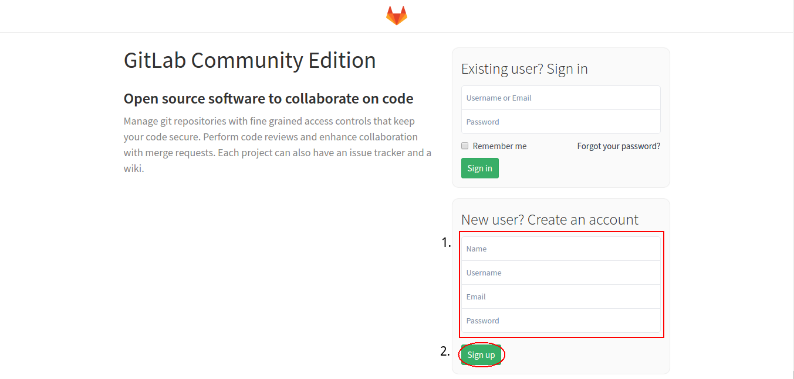
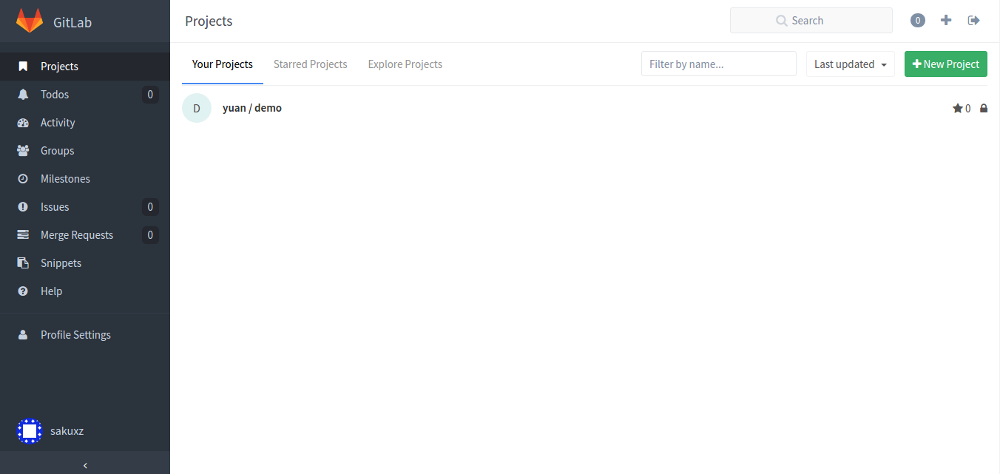

# 環境建立

## 註冊 GitLab

1. 於註冊表單上填寫姓名/帳戶名/Email/密碼（大於8碼）
2. 點擊 Sign Up 按鈕，送出申請
3. 系統會發送認證信到您註冊表單上所填寫的Email地址，依照信上指示即可完成認證

> 如未收到認證信可向該 GitLab 管理者詢問，請管理者開通帳號

## 加入專案進行開發

#### 將您的帳戶名告知專案管裡者，管理者便可以邀請您進入專案進行開發

點擊側邊選單中的 Projects 即可看見您目前擁有或是加入的專案列表

