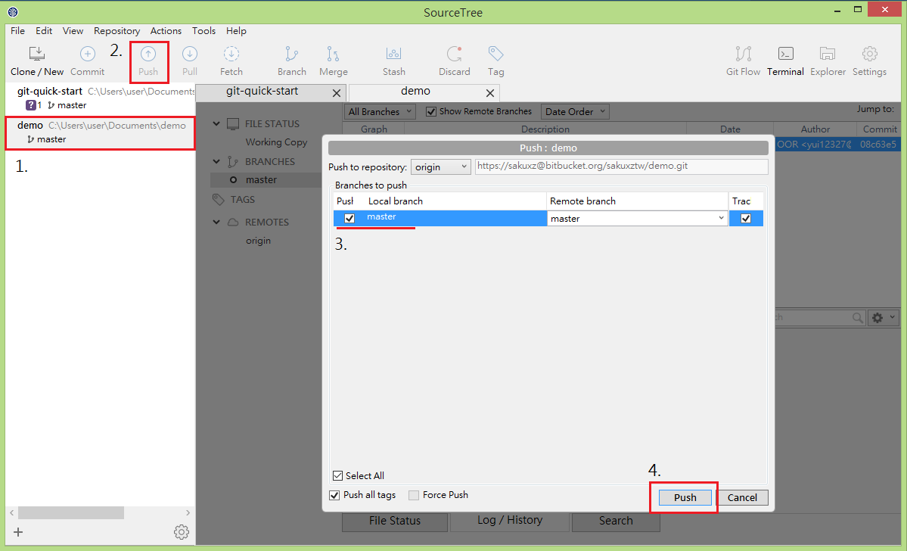

# push

使用 `push` 在遠端數據庫上共享本地端數據庫的修改記錄

push 提交到遠端數據庫前，您可以在您的本地端分支任意地提交或是建立分支，不會因自己的時間或步驟而影響其他成員。

從本地端數據庫 push 到遠端數據庫時，Git會把 push 的分支與遠端數據庫以 fast-forward 合併，如果發生衝突， push 會被拒絕。如果 push 是以non-fast-forward 合併的，Git 也會拒絕您的 push，以防止覆蓋以前的提交。在這種情況下，您需要先 pull 最新的遠端變更，並再進行一次 push。

## 新增您欲紀錄的變更與 Commit

1. 於 SourceTree 左側的專案列表上找到您剛剛修改的專案
2. 點擊 Push 按鈕
3. 選擇您要更新到遠端數據庫上的 branch（在這裡點選 master 即可，branch 觀念會在接下章節介紹）
4. 點擊 Push 按鈕

## 本章節操作對應之 git 指令

`git push -u origin master`
`git push`
