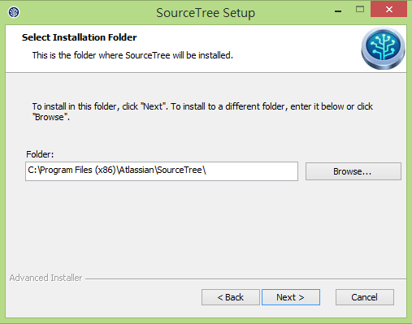
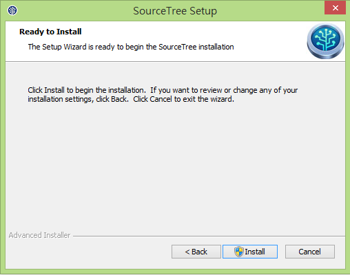
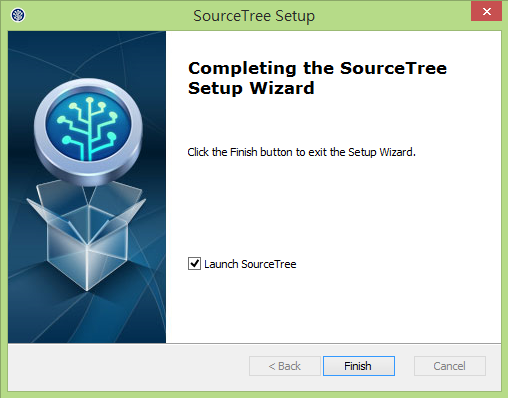
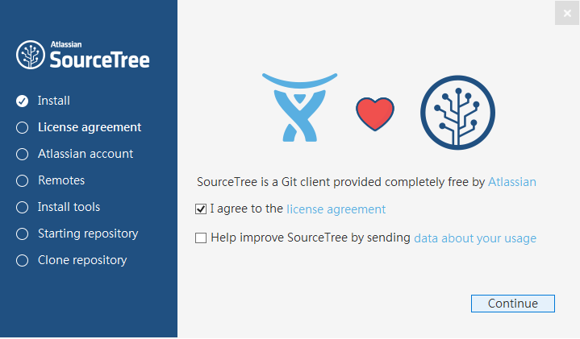
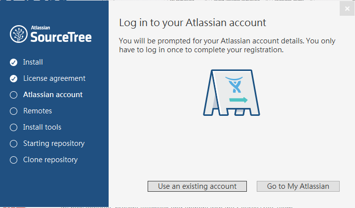
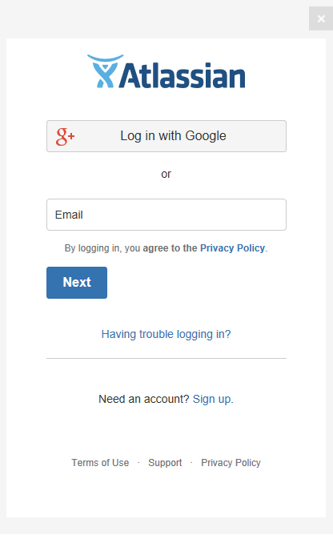
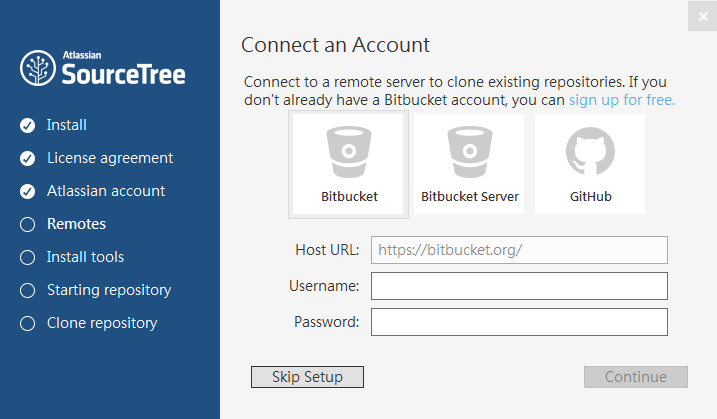
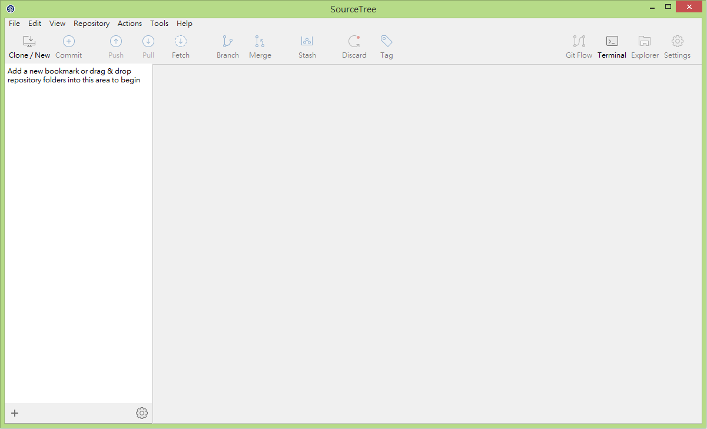

# 安裝 SourceTree

## 前置作業

1. 到 https://id.atlassian.com/signup 註冊 Atlassian 帳號（之後用來開通 SourceTree 用）
2. https://www.sourcetreeapp.com/ 下載您平台適用的安裝程式
3. 雙擊安裝程式開始安裝

## 安裝流程教學

設定安裝位置後點擊 Next

點擊 Install 開始安裝

點擊 Finish 結束安裝程式，程式結束後會自動開啟首次設定頁面

勾選 I agree to the license agreement，點擊 Continue

點擊 Use an existing account

輸入剛剛辦的 Atlassian 帳號/密碼，完成認證

點擊 Skip Setup，完成首次設定（由於我們是用 GitLab 故先不用設定）

開啟 SourceTree，Happy Coding ~
